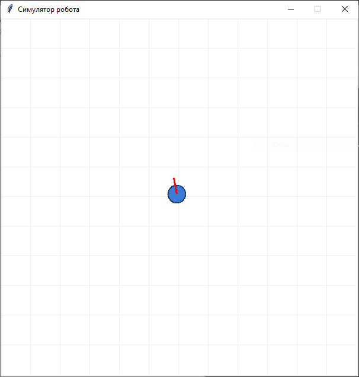
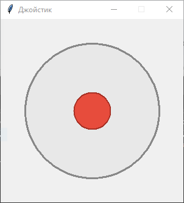

# Симулятор кинематики мобильного робота

Десктопное приложение на Python, реализующее симуляцию движения мобильного робота. Управление осуществляется в реальном времени через отдельное окно с виртуальным джойстиком. Проект использует стандартную графическую библиотеку Tkinter и не требует установки сторонних зависимостей.

# Скриншоты

*Рис. 1 – Общий вид среды*

*Рис. 2 – Вид вспомогательного окна*

## Основные возможности

* **Двухоконный интерфейс:** разделение области симуляции и панели управления для удобства работы.
* **Кинематическая модель:** скорость и траектория робота пропорционально зависят от отклонения рукоятки джойстика.
* **Ограничение рабочей области:** алгоритм предотвращает выход объекта за границы холста (600x600 пикселей).
* **Визуальная навигация:** координатная сетка и вектор направления для оценки траектории и ориентации.
* **Оптимизированная отрисовка:** обновление состояния объектов через метод `coords` вместо пересоздания, что обеспечивает плавную анимацию.

## Требования

* Python 3.6 или выше.
* Модули `tkinter` и `math` (входят в стандартную библиотеку Python, установка через `pip` не требуется).

## Установка и запуск

1. Клонируйте репозиторий и перейдите в директорию проекта:git clone https://github.com/vdrz/robomaster_refactor cd robomaster_refactor

## Принцип управления

1. При запуске приложения открываются два окна: основное окно симуляции и окно управления («Джойстик»).
2. В окне джойстика зажмите левую кнопку мыши на красной рукоятке.
3. Перемещайте рукоятку в нужном направлении:
   * Угол отклонения определяет вектор движения робота.
   * Расстояние рукоятки от центра определяет текущую скорость (максимальная скорость достигается при максимальном отклонении).
4. Отпускание кнопки мыши возвращает рукоятку в центральное положение, что приводит к немедленной остановке робота.

## Архитектура приложения

Код организован в два основных класса:

* **`App`** — отвечает за главное окно симуляции. Содержит цикл обновления состояния (`update`), рассчитывает физику движения, обрабатывает коллизии с границами холста и управляет отрисовкой объектов (тело робота и вектор направления).
* **`Joystick`** — реализует логику виртуального джойстика. Обрабатывает события мыши (нажатие, перетаскивание, отпускание), ограничивает радиус движения рукоятки и предоставляет метод `get_vector()` для передачи нормализованных координат (в диапазоне от -1 до 1) в основной класс.

## Лицензия

Проект распространяется под лицензией MIT. Подробности см. в файле LICENSE.
